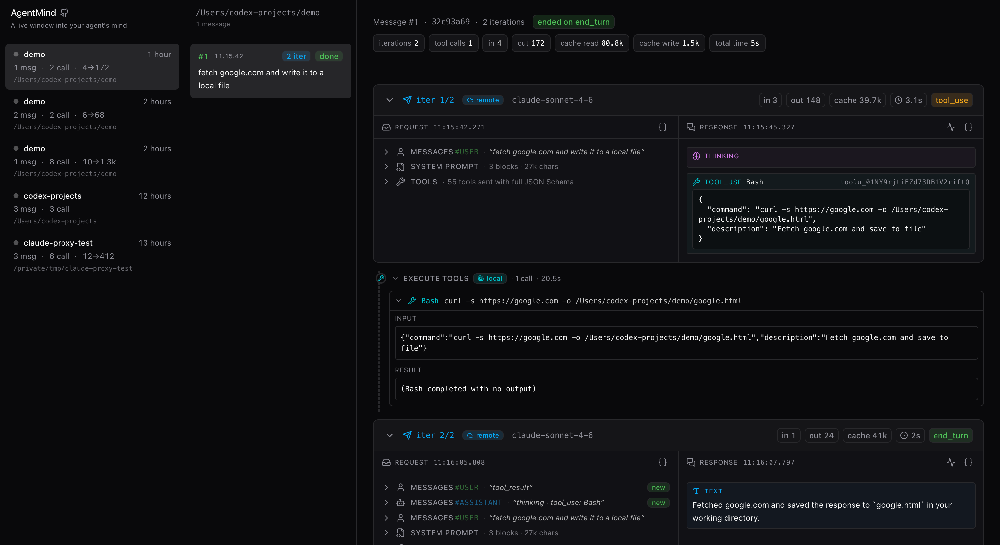

<div align="center">

# AgentMind

### A live window into your agent's mind.

Watch every thought, tool call and reply your coding agent makes — in real time, on your laptop, with zero cloud.

[](https://nodejs.org)
[](https://react.dev)
[](https://tanstack.com/start)
[](https://tailwindcss.com)
[](#license)

<br />



</div>

---

## Why?

Claude Code, Codex CLI and friends do _a lot_ between you pressing Enter and
the final reply: read files, run shell commands, reason out loud, retry,
backtrack. The terminal only shows you the polished, redacted top layer.

**AgentMind sits between your agent and the LLM**, so it sees the full
unredacted truth — every request payload, every SSE chunk, every
`tool_use`/`tool_result` pair, every `thinking` block — and lays it out as a
three-pane inspector you can read like a code editor.

Use it to:

- **Debug "why did my agent do _that_?"** — see the exact tool args, the
  thinking that led there, the previous turn's `tool_result` it was
  reacting to.
- **Audit context bloat** — the request shows the full system prompt, every
  tool's JSON Schema, every cached message, and how much each iteration
  inherits.
- **Learn how good agents are built** — flip through Claude Code's real
  prompts and tool definitions, side-by-side with the responses they produce.
- **Replay a project offline** — everything is captured as plain JSONL on
  your disk; no telemetry, no account, no cloud.

## Quick start

```bash
# 1. Run AgentMind (terminal A)
npx agentmind-cli        # listens on http://127.0.0.1:8088 and opens browser

# 2. Point Claude Code at it (terminal B)
ANTHROPIC_BASE_URL=http://127.0.0.1:8088 claude
```

That's it. Every prompt you type in terminal B shows up in the browser as a
new row — live, while the agent is still streaming. No build step, no DB, no
sign-up.

Install globally if you'd rather not type `npx`:

```bash
npm install -g agentmind-cli
agentmind-cli --help
```

Flags:

| Flag             | Default       | Notes                                      |
| ---------------- | ------------- | ------------------------------------------ |
| `--port <n>`     | `8088`        | Listen port (and the proxy URL claude uses) |
| `--data <dir>`   | `~/.agentmind` | Where the JSONL projects live              |
| `--no-open`      | _off_         | Skip the auto-open browser step            |

## The three panes

<div align="center">
  
</div>

1. **Projects** _(left)_ — one card per `cwd` you ran an agent in. Cards
   show the working directory, how long ago you were there, message count,
   total LLM round-trips, and a compact token tally.
2. **Messages** _(middle)_ — one card per prompt you typed. Each card shows
   how many iterations the agent ran to satisfy it and whether it finished
   cleanly.
3. **Conversation** _(right, the centerpiece)_ — one expandable card per
   HTTP round-trip:
   - **REQUEST** — system prompt, full tool JSON Schemas, the `messages`
     array. New messages added this iteration are tagged `new`, so context
     growth is obvious.
   - **EXECUTE TOOLS** — the in-between segment that runs _locally_
     between two API calls. Tool name, arguments, duration, success/error.
   - **RESPONSE** — `thinking`, `text`, `tool_use` blocks rendered as the
     model emitted them, with token counts and stop reason.

## Live streaming

Open a card while the agent is mid-thought — the **RESPONSE** panel fills in
as SSE chunks arrive (token-by-token text, tool args growing one delta at a
time), and the **REQUEST** panel refreshes when the round-trip is sealed.
A pulsing `streaming` badge and a live-ticking duration timer make the state
unambiguous.

## What gets stored, where

All capture is local-first JSONL — never leaves your machine.

```
~/.agentmind/
└── projects/
    └── <projectId>.jsonl     # projectId = sha256(cwd).slice(0,16)
```

One file per cwd — every `claude` run in the same directory, across
days and proxy restarts, appends to the same file. Each line is one
JSON record:

| `type`        | When written                              | Purpose                          |
| ------------- | ----------------------------------------- | -------------------------------- |
| `project`     | first time a `cwd` is seen                | project metadata                 |
| `message`     | once per user prompt                      | groups iterations                |
| `interaction` | twice per HTTP round-trip (start + final) | last-wins merge on `interactionId` |

API keys in captured headers are redacted to `sk-…NNNN` — you can safely
share a JSONL with a teammate without leaking your key.

## Privacy & safety

- **Local only.** AgentMind binds to `127.0.0.1`. There is no outbound
  traffic except the proxied call to `api.anthropic.com` your agent was
  going to make anyway.
- **No telemetry.** Not now, not later. The only network calls are the ones
  you can see in the inspector.
- **Read-only on disk.** Captured JSONL is append-only; AgentMind never
  edits or deletes files you didn't ask it to.

## Supported agents

| Agent          | Status                          |
| -------------- | ------------------------------- |
| Claude Code    | First-class, fully tested       |
| Claude SDK / API direct callers | Works — set `ANTHROPIC_BASE_URL` |
| Codex CLI      | Roadmap (OpenAI Responses API)  |
| OpenCode       | Roadmap                         |

Anything that respects `ANTHROPIC_BASE_URL` and speaks the Anthropic
Messages API works today. The protocol-agnostic capture layer is on the
roadmap so we can extend the same UI to OpenAI-shaped traffic.

## Tech stack

- **TanStack Start** (Vite-based SSR) · **React 19** · **TanStack Router**
- **Tailwind v4** · **shadcn/ui** · **lucide-react** · **@uiw/react-json-view**
- **undici** for upstream HTTP forwarding with full SSE pass-through
- **pnpm** · **TypeScript 5.7**

## Project layout

```
src/
├── routes/                       file-based routes
│   ├── __root.tsx                three-pane shell + header
│   ├── projects.$pid.tsx         project column wiring
│   └── projects.$pid.messages.$mid.tsx
│                                 message detail (the inspector)
├── components/
│   ├── ProjectsSidebar.tsx       left pane (projects)
│   ├── MessagesPane.tsx          middle pane (prompts)
│   ├── MessageDetail.tsx         right pane wrapper
│   ├── InteractionCard.tsx       one HTTP round-trip card
│   ├── RequestPanel.tsx          request rendering + diff badges
│   ├── ResponsePanel.tsx         response rendering (thinking/text/tool_use)
│   ├── ActionExecutionSegment.tsx local tool execution between calls
│   └── ui/                       shadcn primitives + JSON dialog
├── lib/
│   ├── anthropic-types.ts        API schema
│   └── api.ts                    typed fetch + subscribeLive helper
└── server/                       pure node, no React
    ├── middleware.ts             Connect middleware (mounted in vite.config.ts)
    ├── proxy.ts                  /v1/messages forwarder + SSE tee
    ├── liveRegistry.ts           in-memory live-streaming sessions
    ├── grouping.ts               cwd-based project/message inference
    ├── aggregate.ts              raw capture → display model
    ├── sse.ts                    Anthropic SSE parser
    └── storage.ts                JSONL persistence

bin/cli.js                        global `agentmind-cli` entry
```

## Development

```bash
pnpm install
pnpm dev          # http://127.0.0.1:8088 with HMR (uses vite)
pnpm typecheck    # strict tsc --noEmit
pnpm build        # produces dist/ — what npm publishes
pnpm start        # run the production bundle locally (no vite)
```

The published package ships a prebuilt `dist/` — end users running
`npx agentmind-cli` never touch vite, tsx, or any dev dependency. The CLI
boots a plain `node:http` server in under 100ms.

Optional env vars (testing/dev only — not user-facing):

| Var                       | Default                       | Effect                                      |
| ------------------------- | ----------------------------- | ------------------------------------------- |
| `AGENTMIND_DATA_DIR`      | `~/.agentmind`                | Override storage directory                  |
| `AGENTMIND_UPSTREAM`      | `https://api.anthropic.com`   | Override upstream (integration testing)     |
| `AGENTMIND_VERBOSE`       | `1`                           | Set to `0` to silence per-request logs      |

## Roadmap

- [ ] OpenAI Responses API capture (Codex CLI, OpenCode)
- [ ] Cross-project search & filters
- [ ] Diff view between adjacent iterations' `messages` arrays
- [ ] Shareable "trace bundles" (export a sanitized project as a tarball)

## Contributing

Issues and PRs welcome at [imsobear/agentmind](https://github.com/imsobear/agentmind).
If you're hunting for something to do, the roadmap items above all have
clean entry points — happy to mentor you through any of them.

## License

MIT
